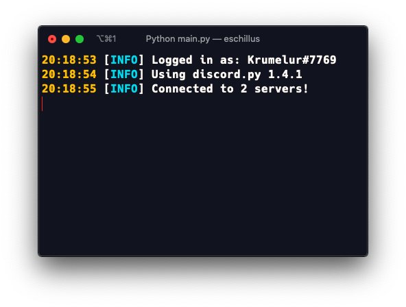

    
    
    <h1 align = "center">Krumelur</h1>
    
A discord bot for my personal server

## About
I've been using discord for a while and I wanted to create a bot for my server, and other servers that I like. The bot's features are both for moderation, fun and utility. Currently the bot is being developed, but it still works as it is.

These are the currently available commands:

* `Help` (obviously)

* `Say` Sends your message.

* `Embed` Embeds your message.

* `Clear` Clears given amount of messages.

*  `Addrole` Adds a role with given name and color

* `Randint` Sends a random integer between x and y.

* `Info` Sends an embed with info about the bot.

### Invite
Click [Here](https://discord.com/oauth2/authorize?client_id=711597309124673536&scope=bot&permissions=8) to invite Krumelur to your discord server!

### Built using
* [Python 3.8.5](https://www.python.org/downloads/release/python-385)
* [Discord.py](https://github.com/Rapptz/discord.py)

### License
Krumelur is distributed under the MIT License Read the `LICENSE` file for more information.
